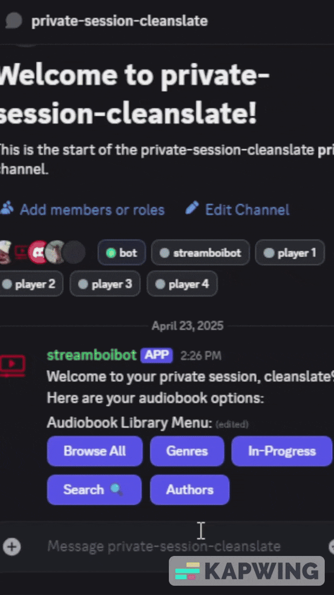
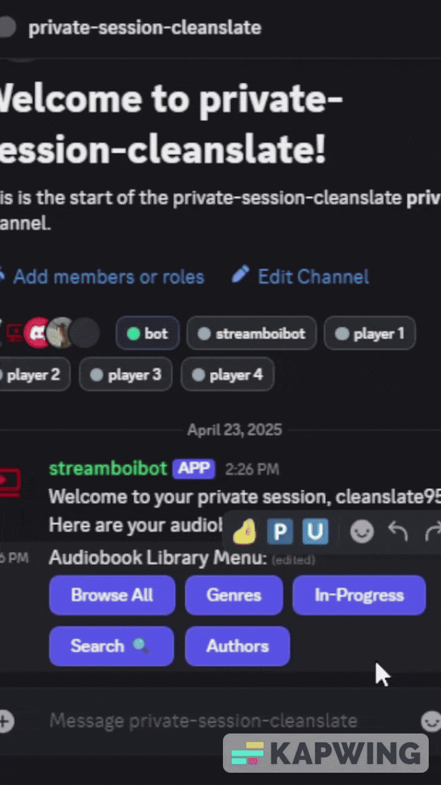
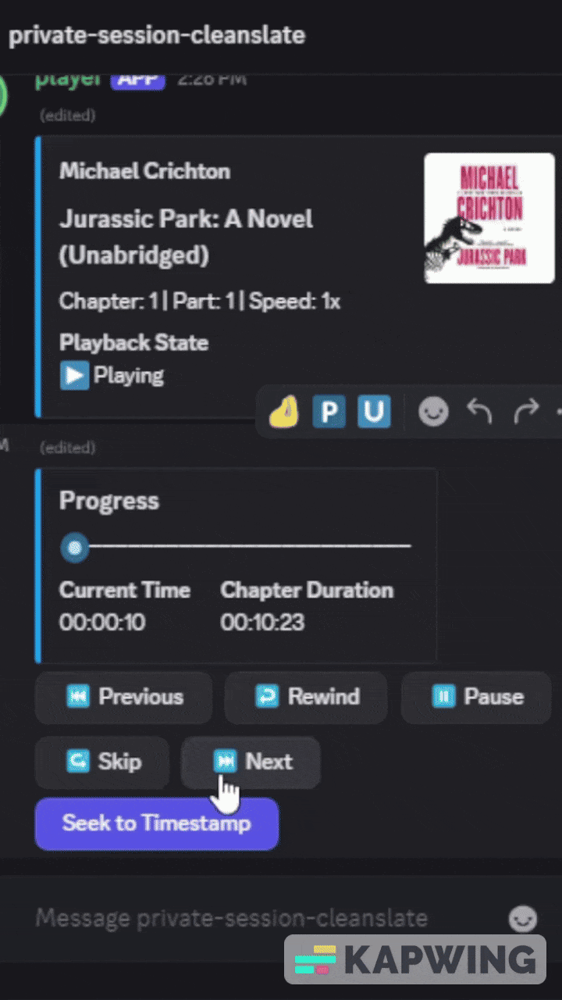

---

# **MultiMediaOnDemand**

### **Author:** Sean Parker

---

## **Overview**
The `MultiMediaOnDemand` project is a comprehensive system designed to integrate various multimedia services, including Discord-based playback, DVR catalog management, live streaming, and remote control APIs. This project aims to provide a seamless and user-friendly experience for managing and consuming multimedia content.

---

## **Project Components**
The repository consists of the following key services and modules:

### **1. DiscordBot**
- A bot system for Discord that supports:
  - **Master Bot**: Manages interactions and delegates playback tasks to minion bots.
  - **Minion Bots**: Handle individual playback instances for users in separate Discord channels.
- Features:
  - Audiobook playback with chapter and timestamp tracking.
  - Playback controls (play, pause, skip, rewind, etc.).
  - Dynamic UI updates in Discord chat (e.g., seek bars, playback state).
  - Multi-user support with isolated playback sessions.
  - Integration with SMB shares for accessing media files.

---

## **Features**
- **Multi-User Playback:**
  - Supports multiple users with isolated playback sessions.
  - Each user can control their own playback without interfering with others.

- **Discord Integration:**
  - Playback controls and updates directly in Discord chat.
  - Dynamic UI elements like seek bars and playback state indicators.

- **Media Processing:**
  - Efficient audio processing using FFmpeg.
  - Support for SMB shares to access media files across platforms.

- **Cross-Platform Support:**
  - Designed to run on both Windows and Linux (including Raspberry Pi).

- **Scalability:**
  - Modular architecture allows for easy addition of new minion bots and services.

---

## **License**
This project is licensed under the ISC License. See the `LICENSE` file for details.

---

## **Audiobook Bot Features**

#### Browse Catalog

---

#### Browse Genres or Authors

---

#### View Listens with Progress

---

#### Quickly View Listens

---

#### Resume Pevious Session

---

#### Search for Titles

---

#### Playback Controls

---

#### Seek to Timestamp

